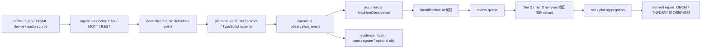

# BirdNET-Go event-only ingest contract v0.1

Status: Draft for implementation planning
Date: 2026-05-04
Owner: ikimon.life technical planning

## 1. Decision

ikimon.life will ingest BirdNET-Go / TinyML passive-audio detections as event-only records through the current Node/TypeScript runtime boundary. This contract does not implement a legacy PHP importer and does not write to `upload_package/`.

The invariant is the normalized audio detection event. BirdNET-Go, TinyML devices, future acoustic models, CSV files, MQTT payloads, and REST push sources are adapters. The canonical record remains in ikimon.life as `observation_event + occurrence + evidence + identification + review`.

Primary implementation boundary, subject to code-level design in the next phase:

- `E:\Projects\03_ikimon.life_Product\platform_v2\`
- existing audio surfaces found during boundary check:
  - `E:\Projects\03_ikimon.life_Product\platform_v2\src\routes\adminAudioApi.ts`
  - `E:\Projects\03_ikimon.life_Product\platform_v2\src\services\audioReview.ts`
  - `E:\Projects\03_ikimon.life_Product\platform_v2\src\services\tierPromotion.ts`
  - `E:\Projects\03_ikimon.life_Product\platform_v2\db\migrations\0014_audio_segments.sql`
  - `E:\Projects\03_ikimon.life_Product\platform_v2\db\migrations\0039_audio_review_workflow.sql`

Explicit non-goals for v0.1:

- No direct legacy PHP implementation.
- No permanent server-side raw audio archive by default.
- No claim that BirdNET output is correct without review.
- No claim that the resulting report proves TNFD compliance, OECM recognition, or biodiversity improvement.

Allowed business wording:

- "補助資料"
- "検討材料"
- "モニタリング開始コストを下げる可能性"
- "AI候補"
- "reviewer検証済み"

Forbidden wording:

- "TNFD準拠を証明"
- "自然共生サイト認定を保証"
- "生物多様性改善を証明"
- "BirdNETの同定は正しい"
- "AIで研究グレード確定"

## 2. Architecture flow



BirdNET-Go source discovery endpoints such as `GET /api/v2/system/audio/sources` and `GET /api/v2/streams/sources` are discovery inputs only. They are not observation records.

BirdNET-Go `nightly-20260502` changed MQTT source identity so `sourceId` is derived from a SHA-256 hash of the connection string and `sourceName` carries a human-readable audio source name. ikimon.life must store both, because `sourceId` may change once after upgrade while `sourceName` is better for human filtering.

## 3. TypeScript-friendly normalized event

```ts
export type PassiveAudioSourceType = "birdnet_go_csv" | "birdnet_go_mqtt" | "birdnet_go_rest" | "tinyml_rest" | "manual_test_fixture";

export type AudioConsentScope = "private" | "community" | "public";

export type AudioDetectionMethod = "ai_audio";

export type BasisOfRecord = "MachineObservation";

export type SamplingProtocol = "passive-audio";

export type NormalizedPassiveAudioDetectionEventV01 = {
  ingest_schema_version: "birdnet-go-event-only-v0.1";
  source_type: PassiveAudioSourceType;
  source_id: string;
  source_name: string;
  site_id: string;
  observed_start_at: string;
  observed_end_at: string;
  timezone: string;
  species_label: string;
  confidence: number;
  detection_method: AudioDetectionMethod;
  basisOfRecord: BasisOfRecord;
  samplingProtocol: SamplingProtocol;
  provenance: {
    created_by: "import" | "passive_engine";
    imported_at: string;
    adapter_name: string;
    adapter_version: string;
    raw_payload_hash?: string;
  };
  plot_id?: string;
  lat?: number;
  lng?: number;
  coordinate_uncertainty_m?: number;
  scientific_name?: string;
  vernacular_name?: string;
  taxon_concept_version?: string;
  model_id?: string;
  model_version?: string;
  birdnet_go_version?: string;
  device_id?: string;
  audio_snippet_hash?: string;
  spectrogram_ref?: string;
  clip_ref?: string;
  consent_scope?: AudioConsentScope;
};
```

Validation rules:

- `confidence` must be `0 <= confidence <= 1`.
- `observed_start_at` and `observed_end_at` must be ISO 8601 timestamps.
- `observed_end_at` must be greater than or equal to `observed_start_at`.
- `site_id` is required before production ingest. Local fixtures may use a controlled test site ID.
- `source_id` must be stable enough for deduplication but is not the only identity key.
- The stable source key is `source_type + source_id + source_name + site_id + device_id?`.
- `consent_scope` defaults to `private` if omitted.

## 4. Input adapters

### 4.1 CSV input

Required columns:

- `species`
- `confidence`
- `start_time`
- `end_time`
- `file`

Optional columns:

- `scientific_name`
- `common_name`
- `source_name`
- `site_id`
- `plot_id`
- `lat`
- `lng`
- `timezone`
- `model_id`
- `model_version`
- `birdnet_go_version`

Mapping:

- `species` -> `species_label`
- `confidence` -> `confidence`
- `start_time` -> `observed_start_at`
- `end_time` -> `observed_end_at`
- `file` -> `provenance.raw_payload_hash` input material and optional `audio_snippet_hash` source, not public evidence by itself

### 4.2 MQTT input

Required payload fields:

- `sourceId`
- `sourceName`
- `timestamp`
- `species` or `scientificName`
- `confidence`

Optional payload fields:

- `startOffsetSec`
- `endOffsetSec`
- `deviceId`
- `topic`
- `model_id`
- `model_version`
- `payload_hash`

Mapping:

- `sourceId` -> `source_id`
- `sourceName` -> `source_name`
- `timestamp + startOffsetSec` -> `observed_start_at`
- `timestamp + endOffsetSec` -> `observed_end_at`
- `scientificName` -> `scientific_name`
- `species` -> `species_label`

### 4.3 REST input

Target shape:

- `POST /api/v1/ingest/audio-detections`
- body: one `NormalizedPassiveAudioDetectionEventV01` or a bounded array of them
- auth: server-side ingest key or device credential; never a public anonymous endpoint
- response: accepted count, rejected count, validation errors, dedupe keys

The endpoint name is a proposed current-runtime target. Exact path and file ownership must be decided during the `platform_v2` implementation phase.

## 5. Canonical Schema mapping

### observation_event

- `eventID`: generated UUID.
- `observed_at`: `observed_start_at`.
- `recorded_at`: ingest time.
- `source_device`: `device_id` or `source_name`.
- `samplingProtocol`: `passive-audio`.
- `samplingEffort`: time window duration, source name, and device/site context.
- `schemaVersion`: canonical schema version active in `platform_v2`.
- `provenance`: adapter name/version, source identity, raw payload hash.

### occurrence

- `occurrenceID`: generated UUID.
- `eventID`: linked event.
- `basisOfRecord`: `MachineObservation`.
- `occurrenceStatus`: `present`.
- `scientific_name`, `vernacular_name`, `taxon_concept_version`: copied when available; otherwise left unresolved for review.
- `evidence_tier`: starts at Tier 1 unless Tier 1.5 policy applies.

### evidence

- `evidenceID`: generated UUID.
- `eventID` and `occurrenceID`: linked IDs.
- `media_type`: `audio-derived`.
- `audio_snippet_hash`: optional, used for future equality checks only.
- `spectrogram_ref`: optional reviewer-facing derivative.
- `clip_ref`: optional short private/community clip.
- `captureTimestamp`: `observed_start_at`.
- `checksum`: hash of derivative evidence when stored.

### identification

- `identificationMethod`: `ai_audio`.
- `model_id`: e.g. `birdnet`.
- `model_version`: BirdNET model / BirdNET-Go version when known.
- `confidence`: normalized confidence score.
- `identificationVerificationStatus`: `raw`, `semi-validated`, or `reviewed`.
- `is_current`: true for the latest candidate until reviewer override.

### review

- reviewer action: approve, reject, uncertain.
- reviewer identity and authority level.
- reason / note.
- timestamp.
- audit log.
- Tier transition.

### derived report

Reports are regenerated from canonical records. They must distinguish:

- Tier 1 AI候補
- Tier 1.5 auto-promoted candidate
- Tier 2 reviewer approved
- Tier 3 複数reviewer / expert / secondary evidence

Enterprise-facing report text must frame results as 補助資料 or 検討材料.

## 6. Evidence Tier policy

Tier 1: raw machine detection.

- AI音響のみ。
- 人間未レビュー。
- Internal analysis, review queue, and additional-observation quest triggers only.

Tier 1.5: auto-promoted candidate.

- Initial threshold: `confidence >= 0.90`.
- Species must be plausible for the location, season, and habitat.
- Rare species must not auto-promote.
- The source must have stable identity.
- The same file/time-window duplicate must be suppressed.
- This is not human review.

Tier 2: reviewer approved.

- One or more reviewer approvals.
- Usable as citizen-science data inside ikimon.life.

Tier 3: multiple reviewer / expert / secondary evidence.

- Multiple reviewer agreement, expert approval, or secondary evidence such as photo, video, spectrogram, or site context.
- Preferred tier for enterprise-facing 補助資料.

Demotion or hold conditions:

- low confidence
- regionally implausible species
- seasonally implausible species
- activity-time mismatch
- missing or unstable source identity
- unknown model version
- duplicate same-window detection
- rare species flag
- reviewer disagreement
- suspected human voice or privacy issue
- no supporting environmental evidence for important claims

## 7. Audio retention and privacy

Default policy:

- Store event metadata, provenance, optional spectrogram, optional short clip reference.
- Do not permanently store raw server-side audio by default.
- Default `consent_scope` is `private`.
- Public release requires Tier 2+, privacy check, rare species handling, and clear license/consent.

Trade-off:

- Event-only ingest reduces privacy, storage, consent, and breach risk.
- Event-only ingest weakens future reanalysis, third-party verification, uncertainty assessment, and open/reproducible science.
- `audio_snippet_hash` can prove equality against a retained clip, but cannot recreate sound for re-identification.

Retention options:

| Option | Benefit | Cost | v0.1 stance |
|---|---|---|---|
| event-only + hash | Lowest risk and storage | Weak revalidation | Required baseline |
| spectrogram | Helps review, lower privacy risk than audio | Still derivative only | Recommended |
| short clip | Stronger review and auditability | Human voice/privacy risk | Optional private/community |
| raw retention window | Best future reprocessing during review | High governance burden | Device/private storage only unless approved |

Human voice, address-like speech, enterprise site details, and precise repeated location traces are treated as privacy-sensitive.

## 8. PoC gates and schedule

The previous 2026-03-24 to 2026-04-06 setup window is historical. As of 2026-05-04, the operative plan is:

### 2 weeks: 2026-05-04 to 2026-05-17

- Finalize this contract.
- Confirm G1-G7 measurement fields are derivable from normalized events and review logs.
- Decide source identity, consent, and evidence retention defaults.

Success:

- Contract reviewed and accepted.
- G1-G7 are measurable without raw audio.

Conditional Go:

- Only the audio retention detail remains unresolved.

No-Go:

- Canonical mapping or privacy policy cannot be made explicit.

### 1 month: 2026-05-04 to 2026-06-03

- Confirm current-runtime implementation points in `platform_v2`.
- Prepare event-only sample import using fixture CSV/MQTT payloads.
- Confirm review queue minimum UX requirements.

Gates:

- G1: Tier 1 event count >= 10/hour.
- G2: Tier 1.5 auto-promotion reviewer-confirmed correctness >= 80%.
- G3: median review time <= 3 minutes/record.
- G5: active reviewer expectation >= 5.

### 3 months: 2026-05-04 to 2026-08-03

Gates:

- G1: Tier 1 event count >= 10/hour.
- G2: Tier 1.5 correctness >= 80%.
- G3: review time <= 3 minutes/record.
- G4: Tier 1 to Tier 2 median <= 72 hours.
- G5: active reviewers >= 5.
- G6: server CPU peak < 70%.
- G7: storage growth < 50 GB over 3 months.

Decision:

- Go: G1-G5 all pass and G6-G7 stay controlled.
- Conditional Go: one or two G1-G5 misses with a known fix.
- No-Go: three or more G1-G5 misses, or unresolved reviewer / privacy / license blocker.

## 9. Implementation backlog

P0:

- Add this contract at `E:\Projects\03_ikimon.life_Product\docs\architecture\birdnet_go_event_ingest_contract_v0_1.md`.
- Add a pointer from `E:\Projects\03_ikimon.life_Product\docs\strategy\v3.8\appendix_c_phase6_poc.md`.
- Treat legacy PHP importer paths as historical only.

P1:

- Add `platform_v2` TypeScript types for `NormalizedPassiveAudioDetectionEventV01`.
- Add CSV/MQTT/REST adapter tests with fixture payloads.
- Add a current-runtime ingest service that writes to existing audio/canonical tables or a new migration if the current tables cannot represent the contract.
- Add Tier 1.5 promotion rules for passive audio without weakening existing Tier 2+ authority gates.

P2:

- Add KPI aggregation for G1-G7.
- Add spectrogram / optional clip retention controls.
- Add site / plot derived report sections using conservative wording.
- Compare BirdNET-Go edge device, mobile TinyML, and other low-power acoustic devices after G1-G7 instrumentation exists.

## 10. Risks and controls

License:

- BirdNET-Go is CC BY-NC-SA 4.0. Embedded eBird/Clements-derived taxonomy has non-commercial constraints. Commercial or enterprise-facing use needs legal review before production use.

Japanese bird accuracy:

- Do not extrapolate global BirdNET performance to Shizuoka. G2 must be measured with reviewer validation.

Reviewer supply:

- G5 is a gate. Review capacity must be tracked as active reviewers multiplied by median reviews per reviewer.

Privacy:

- Human voice, address-like speech, enterprise site information, and repeated precise location traces are sensitive. Default to private/community retention.

Revalidation:

- Event-only design lowers risk but weakens future science. Keep provenance, model version, hash, and spectrogram at minimum.

Server load:

- Audio inference stays at the edge by default. `platform_v2` ingests events and derivatives. G6 monitors CPU peak.

Overclaiming:

- Derived reports are補助資料 and 検討材料 only. Tier labels must be visible in any report or export.

## 11. First operational artifact after this contract

Create a manual mapping table from one hour of sample BirdNET-Go CSV/MQTT payloads before writing the ingest endpoint. The mapping table must prove that G1-G7 can be calculated from normalized events, review logs, and server metrics without relying on legacy PHP or permanent raw audio storage.

Current artifact:

- `E:\Projects\03_ikimon.life_Product\docs\architecture\birdnet_go_one_hour_fixture_mapping_v0_1.md`
