# `/map` staging QA — 2026-04-19

- 対象: [https://staging.ikimon.life/map?bm=esri&lng=137.8589&lat=34.7219&z=10.6](https://staging.ikimon.life/map?bm=esri&lng=137.8589&lat=34.7219&z=10.6)
- Viewport: `1440x900`, `1280x800`, `1024x768`, `390x844`
- 実施方法: Playwright 実ブラウザで `initial` / `selected` / `pending-search` / `filters` を撮影。あわせて `share/link restore` と `desktop place card / mobile bottom sheet` を確認。
- 保存先: `docs/review/map-staging-qa-2026-04-19/`

## Verdict

- Blocker はなし。
- `この範囲で再検索`、desktop の map 内 place card、mobile の bottom sheet、filter drawer、share/link restore は確認できた。
- ただし「地図が主役」という観点では、`1024 desktop` と `390 mobile` にまだ明確な圧迫感が残る。

## Findings

### `[P2]` `1024px` では map overlay card が大きすぎ、地図の有効面がかなり削られる

- `selected card` と `静かな前進` card が縦に重なり、地図中央の可視面を強く圧迫する。
- 初期状態でも map は前より広いが、選択後は「地図が主役」より「card が主役」に寄る。
- 対応の第一候補は、`1024-1180px` 帯だけ overlay card を縮小するか、insight card を footer/flyout に逃がすこと。

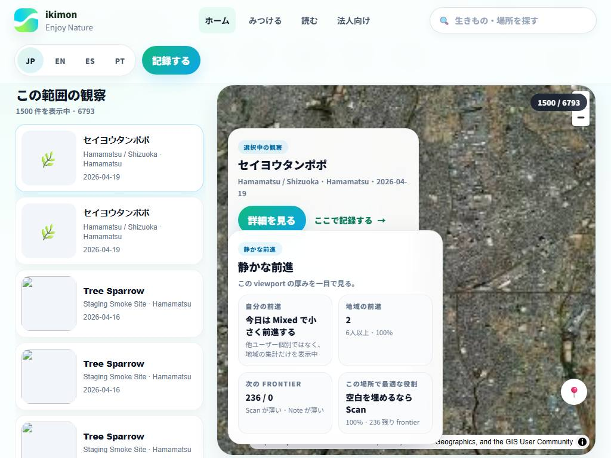

### `[P2]` `390px mobile` は header search + map search の二段で、first fold が controls に寄りすぎる

- 初期表示の 1 画面目で map がほぼ見えず、`map-first` より `filter-first` に感じる。
- mobile では global search と local search が連続して出るので、縦方向の密度が高い。
- 対応の第一候補は、mobile だけ local search を折りたたむか、global search を map page では簡略表示に寄せること。

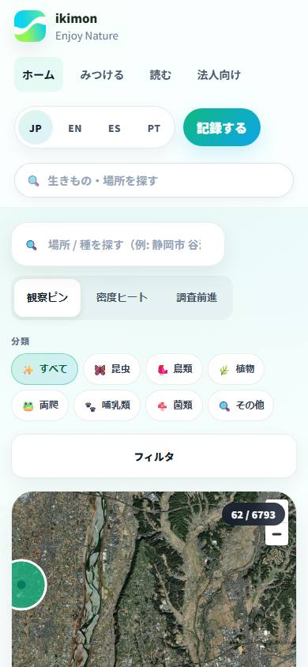

### `[P3]` `1280px` でも selected card と insight card の重なりが強く、map の呼吸が少し詰まる

- `1440px` では許容だが、`1280px` では overlay 2 面が map 左半分へ食い込みやすい。
- `この範囲で再検索` CTA は見えるので動線は壊れていないが、視覚重心はまだ card 側に寄る。

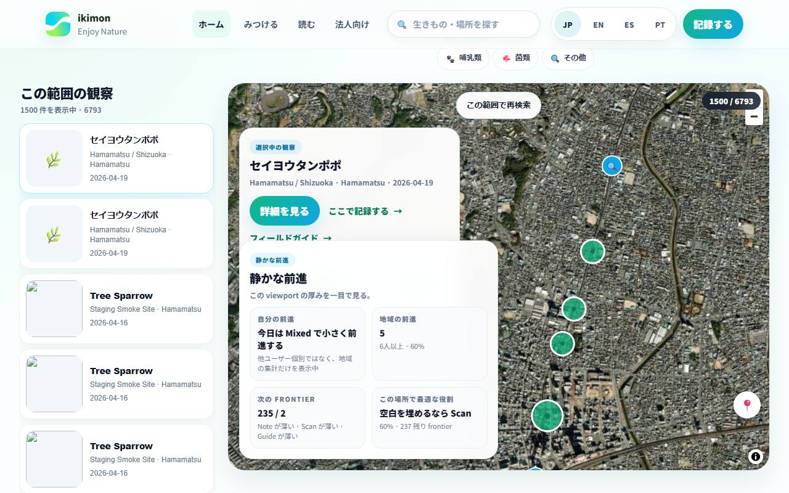

## Confirmed Passes

- `1440 / 1280 / 1024 / 390` すべてで `/map` 自体は表示成功。
- map move 後に auto fetch されず、`この範囲で再検索` CTA が出る。
- Desktop は `#me-map-selection-card` に同期し、Mobile は bottom sheet に出る。
- filter drawer は desktop / mobile とも展開できる。
- share/link restore は `taxon=bird`, `tab=frontier`, `bm=gsi` の復元で確認した。

## Screenshot Set

### Desktop 1440

- 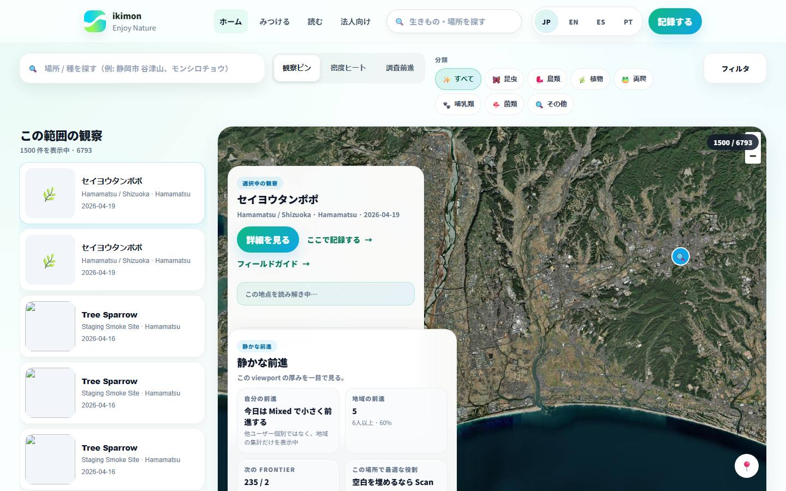
- 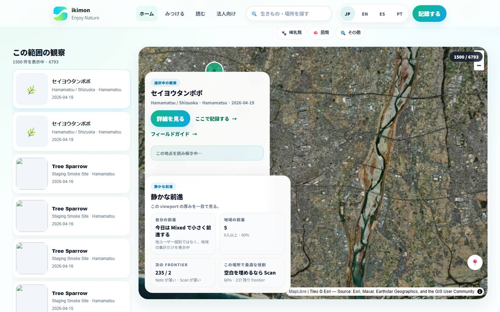
- 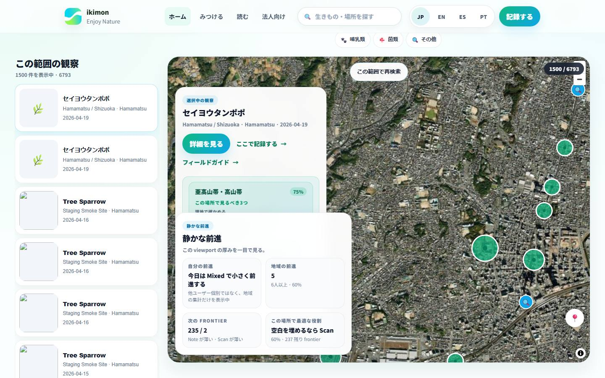
- 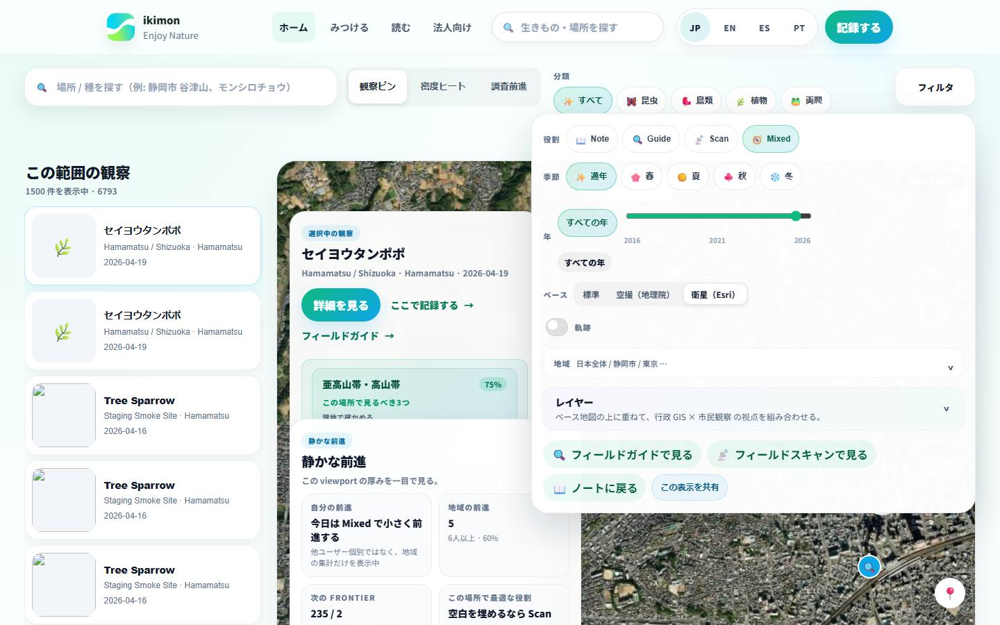

### Desktop 1280

- 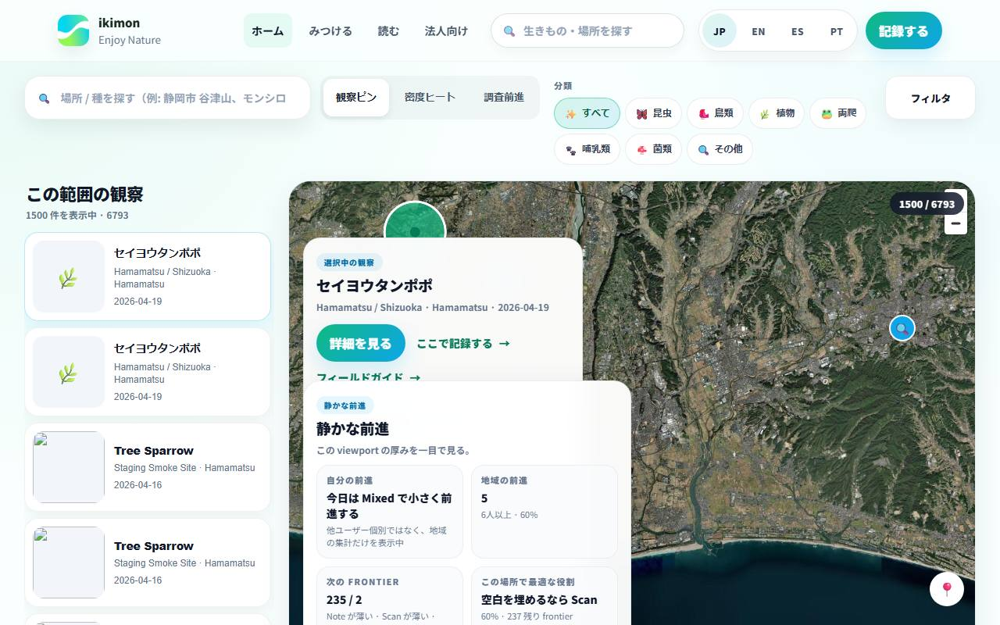
- 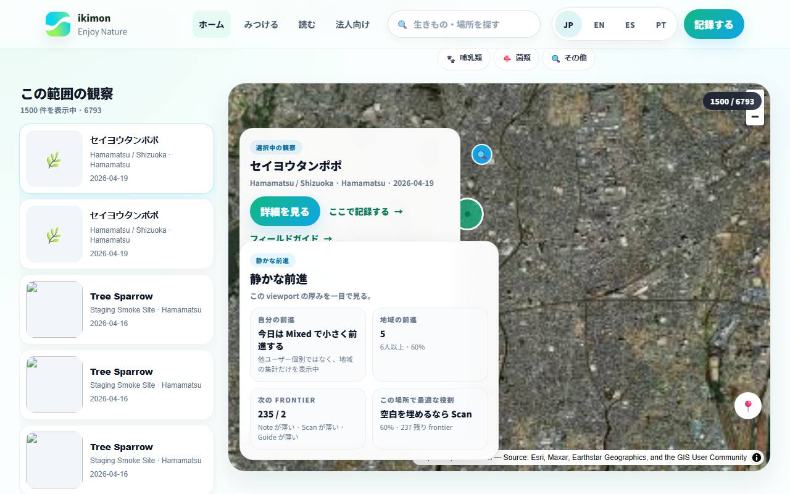
- 
- 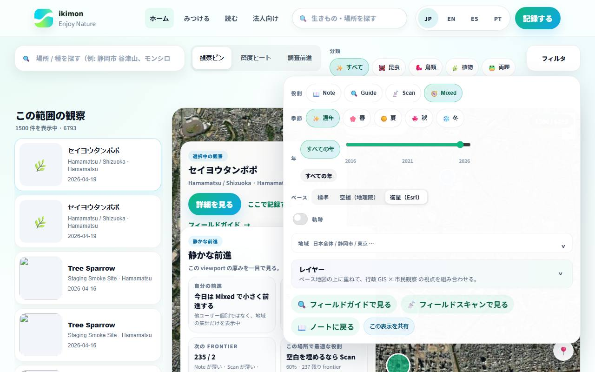

### Desktop 1024

- 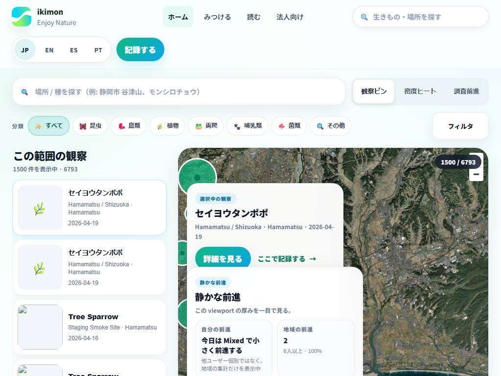
- 
- 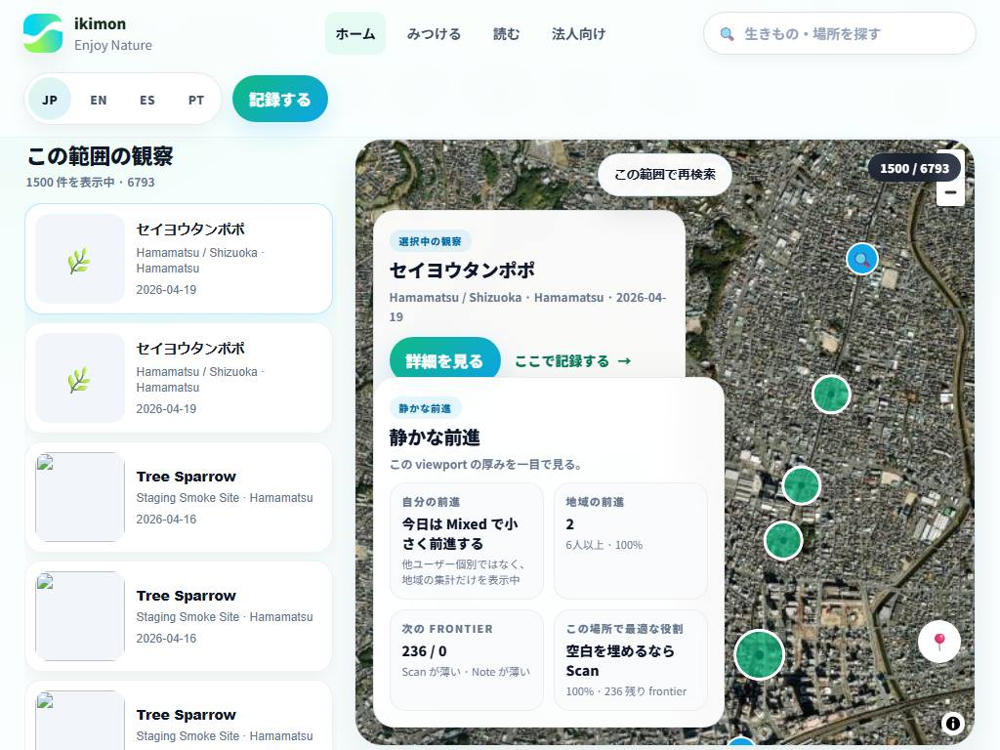
- 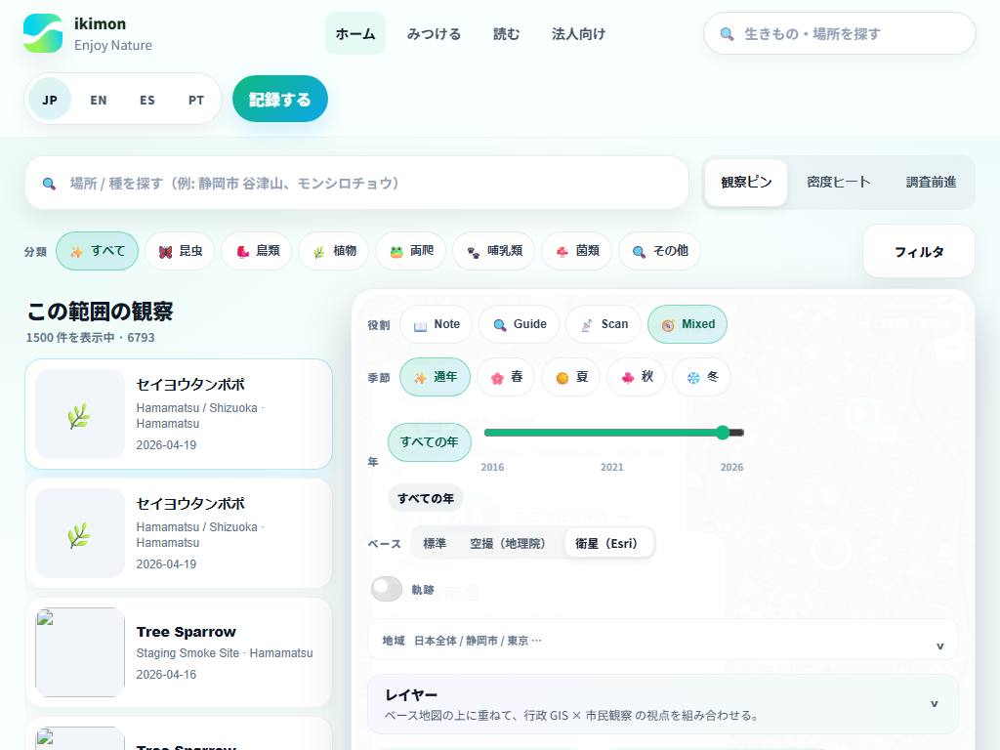

### Mobile 390

- 
- 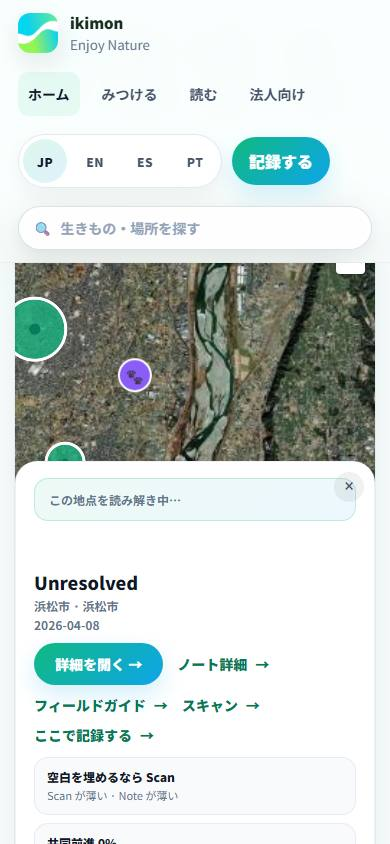
- 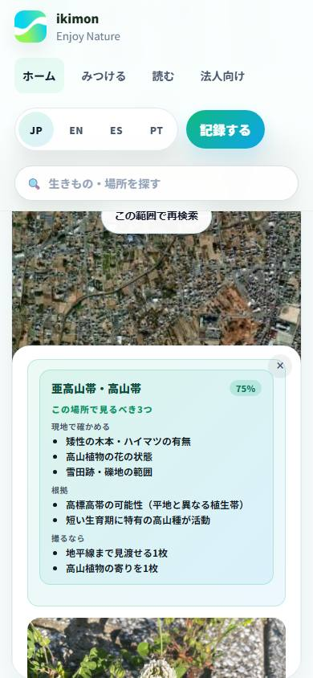
- 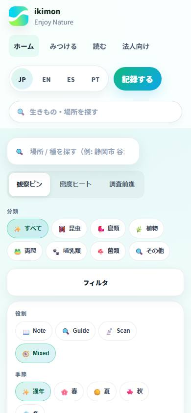
