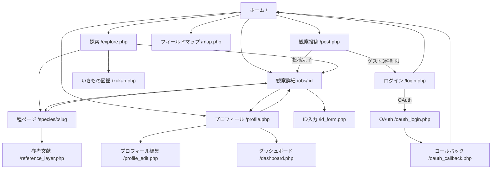
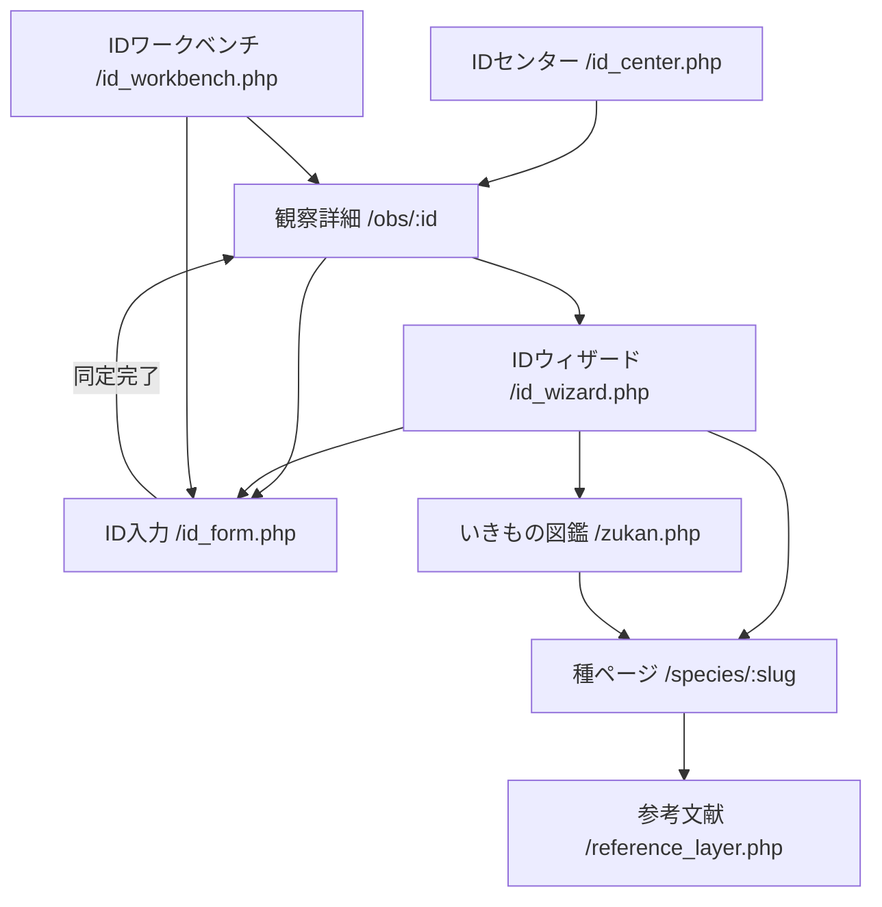
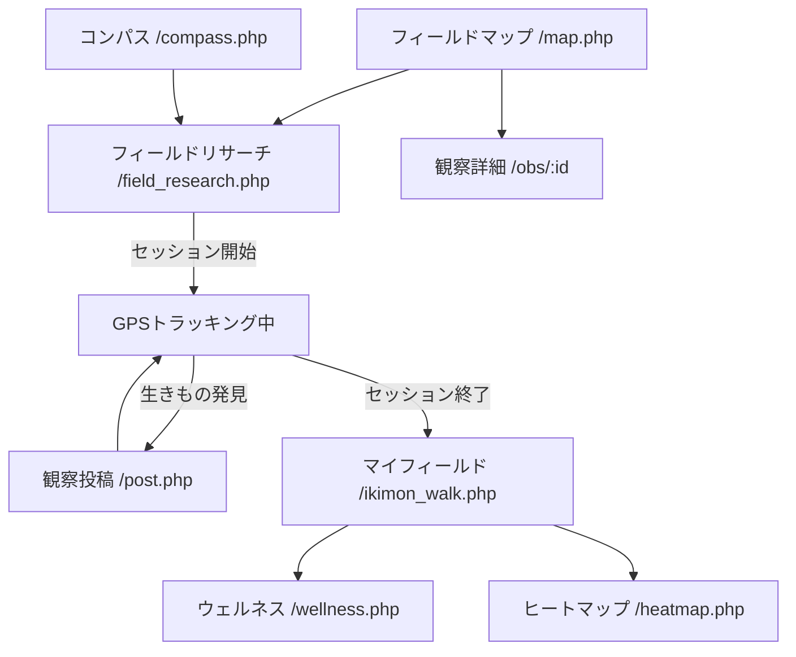
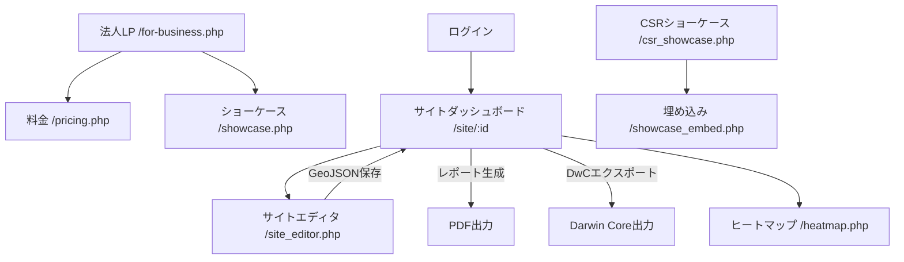
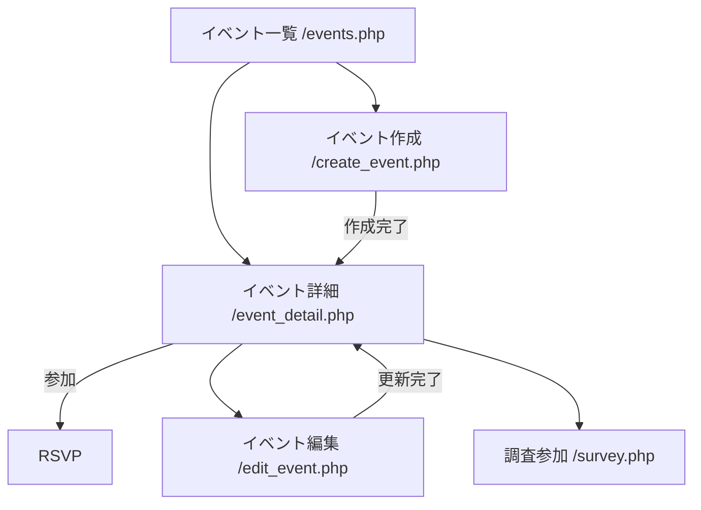
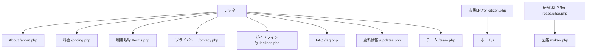

# ikimon.life — 画面遷移図

> 最終更新: 2026-03-04

## 1. メインフロー（市民ユーザー）



## 2. 同定フロー



## 3. フィールドワーク & ウェルネスフロー



## 4. B2Bフロー（企業ユーザー）



## 5. イベントフロー



## 6. 情報ページフロー



## 7. モバイルナビゲーション遷移

```mermaid
graph LR
    BN_HOME[🏠 ホーム] --- BN_EXPLORE[🔍 探す]
    BN_EXPLORE --- BN_POST[➕ 投稿]
    BN_POST --- BN_MAP[🗺 地図]
    BN_MAP --- BN_PROFILE[👤 プロフィール]

    BN_HOME --> HOME[/]
    BN_EXPLORE --> EXPLORE[/explore.php]
    BN_POST --> POST[/post.php]
    BN_MAP --> MAP[/map.php]
    BN_PROFILE --> PROFILE[/profile.php]
```
