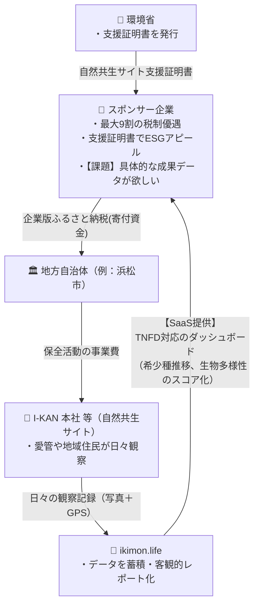

# The Proof Engine: ikimon.life B2B向け モニタリング証拠SaaS戦略

## 1. なぜ今、「客観的データ」がお金に変わるのか？
TNFD（自然関連財務情報開示タスクフォース）やESG投資の潮流により、企業は「環境に良いことをした」というポーズだけでなく、**「科学的・客観的なデータに基づく保全成果の証明」** を求められる時代になりました。

ここで中心となる強力な制度が以下の2つです。
1. **企業版ふるさと納税 × 自然共生サイト支援証明書**
2. **環境保全・生物多様性関連の「補助金・助成金」**

愛管株式会社（I-KAN）のように**「自社で自然共生サイトを所有・管理し、保全活動を行っている事業者」**にとって、**ikimon.life が提供する「継続的な市民観測データ（モニタリング証拠）」は、スポンサー企業を惹きつけ、補助金を獲得するための最強の「免罪符（エビデンス）」として極めて高い価値を持ちます。**

---

## 2. スキーム整理：お金とデータの流れ（我々が「受け取る」側になる戦略）

### スキームA：企業版ふるさと納税を活用した「スポンサー獲得モデル」
環境省の「自然共生サイト」の保全活動に対して、自治体経由で企業版ふるさと納税制度を利用して寄付をした企業は、最大9割の税軽減を受けつつ、自社のESGレポートでアピールできる**「自然共生サイト支援証明書」**を受け取ることができます。

**スポンサー企業側の悩み（課題）：**
証明書は「お金を出した証拠」にはなりますが、毎年の統合報告書で**「私たちが支援した結果、具体的に自然がどう守られたのか？」**を書くための**継続的な生データ（証拠）がありません**。

**ikimon.lifeを武器にしたI-KAN（サイト管理者）の強み（The Proof）：**
我々はただ「寄付してください」とお願いするだけではありません。**「寄付してくれれば、我々のプラットフォーム『ikimon.life』から、御社のESG報告書にそのまま使えるリアルタイムな保全データ（生物多様性スコア、希少種推移、写真）を提供し続けます」**という強烈な付加価値オファーを出せます。

👉 **スポンサー企業にとって、ikimon.lifeによるデータ提供（The Proof）がある自然共生サイトへの寄付は、他の一過性の寄付案件と比べて圧倒的に費用対効果（ESGアピール力）が高くなります。**

### スキームB：各種 補助金・助成金の採択と成果報告の自動化
環境省や民間財団の補助事業は保全活動の重要な資金源ですが、資金獲得には「客観的な効果測定と明確な成果報告」が必須です。

**ikimon.lifeの価値（The Proof）：**
補助金申請の段階で「ikimon.life という市民参加型DXツールを利用し、客観的・持続的なモニタリング体制を構築している」とアピールすることで審査の加点（採択率UP）を狙えます。さらに事務局の毎年の面倒な集計作業（今年は希少種が何匹いたか等）をレポート機能でエクスポートすることで、報告稼働を激減させます。

---

## 3. 最重要課題：「胡散臭いレポート」にしないための科学的根拠（グリーンウォッシュ対策）

スポンサー企業が最も恐れるのは**「グリーンウォッシュ（環境に配慮しているように見せかけるだけの嘘）」**だと批判されること（＝炎上・株価下落）です。
我々が提供するikimon.life のレポートは、決して「胡散臭い適当な数字」であってはなりません。以下の**3つの防波堤**によって、レポートの**科学的信頼性（Integrity）**を担保します。

### ① 証拠主義（Evidence-based）
- **写真とGPSの絶対紐付け:** すべてのレコードには「いつ・どこで・誰が撮ったどんな写真か」という改ざん不可能な証拠が残ります。「〇〇匹いました」と自己申告するだけの旧来の紙のアンケートとは根底から異なります。
- **学名ベースの標準化:** 内部データは政府や学術機関（環境省生物多様性センター等）が使う標準和名・学名のマスタ（Taxonomy Backbone）に準拠しています。

### ② 専門家調査との「補完関係」の明示（ここが一番大事）
- **市民科学の正しい位置づけ:** ikimon.lifeのレポートは「専門家の精緻な定量的調査（例：1平米の中に何匹いるか数える）」の代わりではありません。
- **ikimonの強みは「多頻度・広範囲な定性的モニタリング」です。** 専門家が年に1回しか調査できないのに対し、ikimonは「市民やスタッフが年間通して継続的に見ていること」を証明します。
- **レポートでの表現（免責）:** レポートには「本データは市民科学による継続的な観測結果（Presence-only data）であり、生息密度の増減を完全に保証するものではなく、生物多様性保全に関心を持つコミュニティの活動量と生息確認の証拠を示すものです」という**科学的に誠実なディスクレーマー（注意書き）**を入れます。これが逆に「ちゃんとしている」という信頼（企業側の安心感）に繋がります。

### ③ 環境省レッドリスト等の「外部公的基準」への自動照合
- アプリ内で「AIやユーザーが同定した生き物」を、**「環境省や各都道府県のレッドリスト（絶滅危惧種ランク）」と自動でリアルタイムに照合**します。ikimon側で勝手なランク付けをするのではなく、常に「公的な基準」を引いてくることで、客観性を担保します。

---

## 4. ビジネスオファーモデル（ikimon.life の外販と水平展開）

自社サイト（I-KAN本社）で成功モデルを作った後、ikimon.life は**「他の自然共生サイト管理者」に対してもSaaSとして外販（OEM提供等）可能**です。

| ターゲット | 提供価値 (Value) | マネタイズ手法 |
| :--- | :--- | :--- |
| **🏢 寄付検討企業 (スポンサー)** | ・自社の統合報告書、HPにそのまま載せられるグラフとエビデンス。 ・「自社が守っている森」のリアルタイムダッシュボード（社員のエンゲージメント向上）。 | **寄付の動機付け** （企業版ふるさと納税の確実な獲得・継続） |
| **🌳 他の自然共生サイト管理者** （他企業・NPO） | ・ふるさと納税を集めるための「企業の寄付特典」としてのデータ提供システム。 ・補助金の採択率UPと、毎年の成果報告書の自動作成（事務作業の激減）。 | **サイト管理者向けSaaSプラン** （システム導入費＋月額ライセンス） |

---

## 5. 次に実装・準備すべきアクション (Next Actions)

**【ikimon.life 機能開発】**
1. スポンサー（企業）向けの「専用ダッシュボード表示モード」の実装。（現在の市民向けサイトダッシュボードとは別に、企業が株主等に見せびらかしやすいUIや印刷用画面を作る）
2. 日々の活動記録の Excel / CSV エクスポート機能（補助金成果報告書やESGレポートへ貼り付けるためのデータ化）。
3. レポートUIおよびPDF出力時に、「免責事項（ディスクレーマー）」をフッターに自動印字する機能（グリーンウォッシュ対策）。

**【ビジネス・営業準備】**
1. 浜松市等の自治体と連携し、I-KAN本社自然共生サイトへの「企業版ふるさと納税プロジェクト」を立ち上げる。
2. その際、「寄付企業には、ikimon.lifeを通じたこの様な専用レポート画面を提供します」という**営業用プロトタイプ画面（デモ）**を作成し、PR資料に組み込む。
